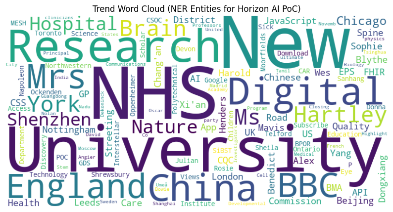

## This Notebook Scipt (PoC case study for Horizon AI) is for broader understanding in terms of data extraction from online media platforms and channels
## It is to be used for illustration purpose ONLY
### Authored by Ejaz Hussain - Last updated: 22-08-2025

## Step 1: Installation of Required Python Libraries & Dependencies [If Required]


```python
#!pip3 install --upgrade pip

!pip3 install feedparser newspaper3k spacy streamlit bertopic scikit-learn sentence-transformers
!pip3 install requests
!pip3 install lxml_html_clean
!pip3 install wordcloud
```

    Requirement already satisfied: feedparser in /Library/Frameworks/Python.framework/Versions/3.13/lib/python3.13/site-packages (6.0.11)
    Requirement already satisfied: newspaper3k in /Library/Frameworks/Python.framework/Versions/3.13/lib/python3.13/site-packages (0.2.8)
    Requirement already satisfied: spacy in /Library/Frameworks/Python.framework/Versions/3.13/lib/python3.13/site-packages (3.8.7)
    Requirement already satisfied: streamlit in /Library/Frameworks/Python.framework/Versions/3.13/lib/python3.13/site-packages (1.48.0)
    Requirement already satisfied: bertopic in /Library/Frameworks/Python.framework/Versions/3.13/lib/python3.13/site-packages (0.17.3)
    Requirement already satisfied: scikit-learn in /Library/Frameworks/Python.framework/Versions/3.13/lib/python3.13/site-packages (1.7.1)
    Requirement already satisfied: sentence-transformers in /Library/Frameworks/Python.framework/Versions/3.13/lib/python3.13/site-packages (5.0.0)
    Requirement already satisfied: sgmllib3k in /Library/Frameworks/Python.framework/Versions/3.13/lib/python3.13/site-packages (from feedparser) (1.0.0)
    Requirement already satisfied: beautifulsoup4>=4.4.1 in /Library/Frameworks/Python.framework/Versions/3.13/lib/python3.13/site-packages (from newspaper3k) (4.13.4)
    Requirement already satisfied: Pillow>=3.3.0 in /Library/Frameworks/Python.framework/Versions/3.13/lib/python3.13/site-packages (from newspaper3k) (11.3.0)
    Requirement already satisfied: PyYAML>=3.11 in /Library/Frameworks/Python.framework/Versions/3.13/lib/python3.13/site-packages (from newspaper3k) (6.0.2)
    Requirement already satisfied: cssselect>=0.9.2 in /Library/Frameworks/Python.framework/Versions/3.13/lib/python3.13/site-packages (from newspaper3k) (1.3.0)
    Requirement already satisfied: lxml>=3.6.0 in /Library/Frameworks/Python.framework/Versions/3.13/lib/python3.13/site-packages (from newspaper3k) (6.0.0)
    Requirement already satisfied: nltk>=3.2.1 in /Library/Frameworks/Python.framework/Versions/3.13/lib/python3.13/site-packages (from newspaper3k) (3.9.1)
    Requirement already satisfied: requests>=2.10.0 in /Library/Frameworks/Python.framework/Versions/3.13/lib/python3.13/site-packages (from newspaper3k) (2.32.4)
    Requirement already satisfied: tldextract>=2.0.1 in /Library/Frameworks/Python.framework/Versions/3.13/lib/python3.13/site-packages (from newspaper3k) (5.3.0)
    Requirement already satisfied: feedfinder2>=0.0.4 in /Library/Frameworks/Python.framework/Versions/3.13/lib/python3.13/site-packages (from newspaper3k) (0.0.4)
    Requirement already satisfied: jieba3k>=0.35.1 in /Library/Frameworks/Python.framework/Versions/3.13/lib/python3.13/site-packages (from newspaper3k) (0.35.1)
    Requirement already satisfied: python-dateutil>=2.5.3 in /Library/Frameworks/Python.framework/Versions/3.13/lib/python3.13/site-packages (from newspaper3k) (2.9.0.post0)
    Requirement already satisfied: tinysegmenter==0.3 in /Library/Frameworks/Python.framework/Versions/3.13/lib/python3.13/site-packages (from newspaper3k) (0.3)
    Requirement already satisfied: spacy-legacy<3.1.0,>=3.0.11 in /Library/Frameworks/Python.framework/Versions/3.13/lib/python3.13/site-packages (from spacy) (3.0.12)
    Requirement already satisfied: spacy-loggers<2.0.0,>=1.0.0 in /Library/Frameworks/Python.framework/Versions/3.13/lib/python3.13/site-packages (from spacy) (1.0.5)
    Requirement already satisfied: murmurhash<1.1.0,>=0.28.0 in /Library/Frameworks/Python.framework/Versions/3.13/lib/python3.13/site-packages (from spacy) (1.0.13)
    Requirement already satisfied: cymem<2.1.0,>=2.0.2 in /Library/Frameworks/Python.framework/Versions/3.13/lib/python3.13/site-packages (from spacy) (2.0.11)
    Requirement already satisfied: preshed<3.1.0,>=3.0.2 in /Library/Frameworks/Python.framework/Versions/3.13/lib/python3.13/site-packages (from spacy) (3.0.10)
    Requirement already satisfied: thinc<8.4.0,>=8.3.4 in /Library/Frameworks/Python.framework/Versions/3.13/lib/python3.13/site-packages (from spacy) (8.3.6)
    Requirement already satisfied: wasabi<1.2.0,>=0.9.1 in /Library/Frameworks/Python.framework/Versions/3.13/lib/python3.13/site-packages (from spacy) (1.1.3)
    Requirement already satisfied: srsly<3.0.0,>=2.4.3 in /Library/Frameworks/Python.framework/Versions/3.13/lib/python3.13/site-packages (from spacy) (2.5.1)
    Requirement already satisfied: catalogue<2.1.0,>=2.0.6 in /Library/Frameworks/Python.framework/Versions/3.13/lib/python3.13/site-packages (from spacy) (2.0.10)
    Requirement already satisfied: weasel<0.5.0,>=0.1.0 in /Library/Frameworks/Python.framework/Versions/3.13/lib/python3.13/site-packages (from spacy) (0.4.1)
    Requirement already satisfied: typer<1.0.0,>=0.3.0 in /Library/Frameworks/Python.framework/Versions/3.13/lib/python3.13/site-packages (from spacy) (0.16.0)
    Requirement already satisfied: tqdm<5.0.0,>=4.38.0 in /Library/Frameworks/Python.framework/Versions/3.13/lib/python3.13/site-packages (from spacy) (4.67.1)
    Requirement already satisfied: numpy>=1.19.0 in /Library/Frameworks/Python.framework/Versions/3.13/lib/python3.13/site-packages (from spacy) (2.2.6)
    Requirement already satisfied: pydantic!=1.8,!=1.8.1,<3.0.0,>=1.7.4 in /Library/Frameworks/Python.framework/Versions/3.13/lib/python3.13/site-packages (from spacy) (2.11.7)
    Requirement already satisfied: jinja2 in /Library/Frameworks/Python.framework/Versions/3.13/lib/python3.13/site-packages (from spacy) (3.1.6)
    Requirement already satisfied: setuptools in /Library/Frameworks/Python.framework/Versions/3.13/lib/python3.13/site-packages (from spacy) (80.9.0)
    Requirement already satisfied: packaging>=20.0 in /Library/Frameworks/Python.framework/Versions/3.13/lib/python3.13/site-packages (from spacy) (25.0)
    Requirement already satisfied: langcodes<4.0.0,>=3.2.0 in /Library/Frameworks/Python.framework/Versions/3.13/lib/python3.13/site-packages (from spacy) (3.5.0)
    Requirement already satisfied: language-data>=1.2 in /Library/Frameworks/Python.framework/Versions/3.13/lib/python3.13/site-packages (from langcodes<4.0.0,>=3.2.0->spacy) (1.3.0)
    Requirement already satisfied: annotated-types>=0.6.0 in /Library/Frameworks/Python.framework/Versions/3.13/lib/python3.13/site-packages (from pydantic!=1.8,!=1.8.1,<3.0.0,>=1.7.4->spacy) (0.7.0)
    Requirement already satisfied: pydantic-core==2.33.2 in /Library/Frameworks/Python.framework/Versions/3.13/lib/python3.13/site-packages (from pydantic!=1.8,!=1.8.1,<3.0.0,>=1.7.4->spacy) (2.33.2)
    Requirement already satisfied: typing-extensions>=4.12.2 in /Library/Frameworks/Python.framework/Versions/3.13/lib/python3.13/site-packages (from pydantic!=1.8,!=1.8.1,<3.0.0,>=1.7.4->spacy) (4.14.1)
    Requirement already satisfied: typing-inspection>=0.4.0 in /Library/Frameworks/Python.framework/Versions/3.13/lib/python3.13/site-packages (from pydantic!=1.8,!=1.8.1,<3.0.0,>=1.7.4->spacy) (0.4.1)
    Requirement already satisfied: charset_normalizer<4,>=2 in /Library/Frameworks/Python.framework/Versions/3.13/lib/python3.13/site-packages (from requests>=2.10.0->newspaper3k) (3.4.2)
    Requirement already satisfied: idna<4,>=2.5 in /Library/Frameworks/Python.framework/Versions/3.13/lib/python3.13/site-packages (from requests>=2.10.0->newspaper3k) (3.10)
    Requirement already satisfied: urllib3<3,>=1.21.1 in /Library/Frameworks/Python.framework/Versions/3.13/lib/python3.13/site-packages (from requests>=2.10.0->newspaper3k) (2.5.0)
    Requirement already satisfied: certifi>=2017.4.17 in /Library/Frameworks/Python.framework/Versions/3.13/lib/python3.13/site-packages (from requests>=2.10.0->newspaper3k) (2025.8.3)
    Requirement already satisfied: blis<1.4.0,>=1.3.0 in /Library/Frameworks/Python.framework/Versions/3.13/lib/python3.13/site-packages (from thinc<8.4.0,>=8.3.4->spacy) (1.3.0)
    Requirement already satisfied: confection<1.0.0,>=0.0.1 in /Library/Frameworks/Python.framework/Versions/3.13/lib/python3.13/site-packages (from thinc<8.4.0,>=8.3.4->spacy) (0.1.5)
    Requirement already satisfied: click>=8.0.0 in /Library/Frameworks/Python.framework/Versions/3.13/lib/python3.13/site-packages (from typer<1.0.0,>=0.3.0->spacy) (8.2.1)
    Requirement already satisfied: shellingham>=1.3.0 in /Library/Frameworks/Python.framework/Versions/3.13/lib/python3.13/site-packages (from typer<1.0.0,>=0.3.0->spacy) (1.5.4)
    Requirement already satisfied: rich>=10.11.0 in /Library/Frameworks/Python.framework/Versions/3.13/lib/python3.13/site-packages (from typer<1.0.0,>=0.3.0->spacy) (14.1.0)
    Requirement already satisfied: cloudpathlib<1.0.0,>=0.7.0 in /Library/Frameworks/Python.framework/Versions/3.13/lib/python3.13/site-packages (from weasel<0.5.0,>=0.1.0->spacy) (0.21.1)
    Requirement already satisfied: smart-open<8.0.0,>=5.2.1 in /Library/Frameworks/Python.framework/Versions/3.13/lib/python3.13/site-packages (from weasel<0.5.0,>=0.1.0->spacy) (7.3.0.post1)
    Requirement already satisfied: wrapt in /Library/Frameworks/Python.framework/Versions/3.13/lib/python3.13/site-packages (from smart-open<8.0.0,>=5.2.1->weasel<0.5.0,>=0.1.0->spacy) (1.17.2)
    Requirement already satisfied: altair!=5.4.0,!=5.4.1,<6,>=4.0 in /Library/Frameworks/Python.framework/Versions/3.13/lib/python3.13/site-packages (from streamlit) (5.5.0)
    Requirement already satisfied: blinker<2,>=1.5.0 in /Library/Frameworks/Python.framework/Versions/3.13/lib/python3.13/site-packages (from streamlit) (1.9.0)
    Requirement already satisfied: cachetools<7,>=4.0 in /Library/Frameworks/Python.framework/Versions/3.13/lib/python3.13/site-packages (from streamlit) (6.1.0)
    Requirement already satisfied: pandas<3,>=1.4.0 in /Library/Frameworks/Python.framework/Versions/3.13/lib/python3.13/site-packages (from streamlit) (2.3.1)
    Requirement already satisfied: protobuf<7,>=3.20 in /Library/Frameworks/Python.framework/Versions/3.13/lib/python3.13/site-packages (from streamlit) (6.31.1)
    Requirement already satisfied: pyarrow>=7.0 in /Library/Frameworks/Python.framework/Versions/3.13/lib/python3.13/site-packages (from streamlit) (21.0.0)
    Requirement already satisfied: tenacity<10,>=8.1.0 in /Library/Frameworks/Python.framework/Versions/3.13/lib/python3.13/site-packages (from streamlit) (9.1.2)
    Requirement already satisfied: toml<2,>=0.10.1 in /Library/Frameworks/Python.framework/Versions/3.13/lib/python3.13/site-packages (from streamlit) (0.10.2)
    Requirement already satisfied: gitpython!=3.1.19,<4,>=3.0.7 in /Library/Frameworks/Python.framework/Versions/3.13/lib/python3.13/site-packages (from streamlit) (3.1.45)
    Requirement already satisfied: pydeck<1,>=0.8.0b4 in /Library/Frameworks/Python.framework/Versions/3.13/lib/python3.13/site-packages (from streamlit) (0.9.1)
    Requirement already satisfied: tornado!=6.5.0,<7,>=6.0.3 in /Library/Frameworks/Python.framework/Versions/3.13/lib/python3.13/site-packages (from streamlit) (6.5.1)
    Requirement already satisfied: jsonschema>=3.0 in /Library/Frameworks/Python.framework/Versions/3.13/lib/python3.13/site-packages (from altair!=5.4.0,!=5.4.1,<6,>=4.0->streamlit) (4.25.0)
    Requirement already satisfied: narwhals>=1.14.2 in /Library/Frameworks/Python.framework/Versions/3.13/lib/python3.13/site-packages (from altair!=5.4.0,!=5.4.1,<6,>=4.0->streamlit) (2.0.1)
    Requirement already satisfied: gitdb<5,>=4.0.1 in /Library/Frameworks/Python.framework/Versions/3.13/lib/python3.13/site-packages (from gitpython!=3.1.19,<4,>=3.0.7->streamlit) (4.0.12)
    Requirement already satisfied: smmap<6,>=3.0.1 in /Library/Frameworks/Python.framework/Versions/3.13/lib/python3.13/site-packages (from gitdb<5,>=4.0.1->gitpython!=3.1.19,<4,>=3.0.7->streamlit) (5.0.2)
    Requirement already satisfied: pytz>=2020.1 in /Library/Frameworks/Python.framework/Versions/3.13/lib/python3.13/site-packages (from pandas<3,>=1.4.0->streamlit) (2025.2)
    Requirement already satisfied: tzdata>=2022.7 in /Library/Frameworks/Python.framework/Versions/3.13/lib/python3.13/site-packages (from pandas<3,>=1.4.0->streamlit) (2025.2)
    Requirement already satisfied: hdbscan>=0.8.29 in /Library/Frameworks/Python.framework/Versions/3.13/lib/python3.13/site-packages (from bertopic) (0.8.40)
    Requirement already satisfied: umap-learn>=0.5.0 in /Library/Frameworks/Python.framework/Versions/3.13/lib/python3.13/site-packages (from bertopic) (0.5.9.post2)
    Requirement already satisfied: plotly>=4.7.0 in /Library/Frameworks/Python.framework/Versions/3.13/lib/python3.13/site-packages (from bertopic) (6.2.0)
    Requirement already satisfied: llvmlite>0.36.0 in /Library/Frameworks/Python.framework/Versions/3.13/lib/python3.13/site-packages (from bertopic) (0.44.0)
    Requirement already satisfied: scipy>=1.8.0 in /Library/Frameworks/Python.framework/Versions/3.13/lib/python3.13/site-packages (from scikit-learn) (1.16.1)
    Requirement already satisfied: joblib>=1.2.0 in /Library/Frameworks/Python.framework/Versions/3.13/lib/python3.13/site-packages (from scikit-learn) (1.5.1)
    Requirement already satisfied: threadpoolctl>=3.1.0 in /Library/Frameworks/Python.framework/Versions/3.13/lib/python3.13/site-packages (from scikit-learn) (3.6.0)
    Requirement already satisfied: transformers<5.0.0,>=4.41.0 in /Library/Frameworks/Python.framework/Versions/3.13/lib/python3.13/site-packages (from sentence-transformers) (4.55.0)
    Requirement already satisfied: torch>=1.11.0 in /Library/Frameworks/Python.framework/Versions/3.13/lib/python3.13/site-packages (from sentence-transformers) (2.7.1)
    Requirement already satisfied: huggingface-hub>=0.20.0 in /Library/Frameworks/Python.framework/Versions/3.13/lib/python3.13/site-packages (from sentence-transformers) (0.34.3)
    Requirement already satisfied: filelock in /Library/Frameworks/Python.framework/Versions/3.13/lib/python3.13/site-packages (from transformers<5.0.0,>=4.41.0->sentence-transformers) (3.18.0)
    Requirement already satisfied: regex!=2019.12.17 in /Library/Frameworks/Python.framework/Versions/3.13/lib/python3.13/site-packages (from transformers<5.0.0,>=4.41.0->sentence-transformers) (2025.7.34)
    Requirement already satisfied: tokenizers<0.22,>=0.21 in /Library/Frameworks/Python.framework/Versions/3.13/lib/python3.13/site-packages (from transformers<5.0.0,>=4.41.0->sentence-transformers) (0.21.4)
    Requirement already satisfied: safetensors>=0.4.3 in /Library/Frameworks/Python.framework/Versions/3.13/lib/python3.13/site-packages (from transformers<5.0.0,>=4.41.0->sentence-transformers) (0.6.1)
    Requirement already satisfied: fsspec>=2023.5.0 in /Library/Frameworks/Python.framework/Versions/3.13/lib/python3.13/site-packages (from huggingface-hub>=0.20.0->sentence-transformers) (2025.7.0)
    Requirement already satisfied: hf-xet<2.0.0,>=1.1.3 in /Library/Frameworks/Python.framework/Versions/3.13/lib/python3.13/site-packages (from huggingface-hub>=0.20.0->sentence-transformers) (1.1.7)
    Requirement already satisfied: soupsieve>1.2 in /Library/Frameworks/Python.framework/Versions/3.13/lib/python3.13/site-packages (from beautifulsoup4>=4.4.1->newspaper3k) (2.7)
    Requirement already satisfied: six in /Library/Frameworks/Python.framework/Versions/3.13/lib/python3.13/site-packages (from feedfinder2>=0.0.4->newspaper3k) (1.17.0)
    Requirement already satisfied: MarkupSafe>=2.0 in /Library/Frameworks/Python.framework/Versions/3.13/lib/python3.13/site-packages (from jinja2->spacy) (3.0.2)
    Requirement already satisfied: attrs>=22.2.0 in /Library/Frameworks/Python.framework/Versions/3.13/lib/python3.13/site-packages (from jsonschema>=3.0->altair!=5.4.0,!=5.4.1,<6,>=4.0->streamlit) (25.3.0)
    Requirement already satisfied: jsonschema-specifications>=2023.03.6 in /Library/Frameworks/Python.framework/Versions/3.13/lib/python3.13/site-packages (from jsonschema>=3.0->altair!=5.4.0,!=5.4.1,<6,>=4.0->streamlit) (2025.4.1)
    Requirement already satisfied: referencing>=0.28.4 in /Library/Frameworks/Python.framework/Versions/3.13/lib/python3.13/site-packages (from jsonschema>=3.0->altair!=5.4.0,!=5.4.1,<6,>=4.0->streamlit) (0.36.2)
    Requirement already satisfied: rpds-py>=0.7.1 in /Library/Frameworks/Python.framework/Versions/3.13/lib/python3.13/site-packages (from jsonschema>=3.0->altair!=5.4.0,!=5.4.1,<6,>=4.0->streamlit) (0.26.0)
    Requirement already satisfied: marisa-trie>=1.1.0 in /Library/Frameworks/Python.framework/Versions/3.13/lib/python3.13/site-packages (from language-data>=1.2->langcodes<4.0.0,>=3.2.0->spacy) (1.2.1)
    Requirement already satisfied: markdown-it-py>=2.2.0 in /Library/Frameworks/Python.framework/Versions/3.13/lib/python3.13/site-packages (from rich>=10.11.0->typer<1.0.0,>=0.3.0->spacy) (3.0.0)
    Requirement already satisfied: pygments<3.0.0,>=2.13.0 in /Library/Frameworks/Python.framework/Versions/3.13/lib/python3.13/site-packages (from rich>=10.11.0->typer<1.0.0,>=0.3.0->spacy) (2.19.2)
    Requirement already satisfied: mdurl~=0.1 in /Library/Frameworks/Python.framework/Versions/3.13/lib/python3.13/site-packages (from markdown-it-py>=2.2.0->rich>=10.11.0->typer<1.0.0,>=0.3.0->spacy) (0.1.2)
    Requirement already satisfied: requests-file>=1.4 in /Library/Frameworks/Python.framework/Versions/3.13/lib/python3.13/site-packages (from tldextract>=2.0.1->newspaper3k) (2.1.0)
    Requirement already satisfied: sympy>=1.13.3 in /Library/Frameworks/Python.framework/Versions/3.13/lib/python3.13/site-packages (from torch>=1.11.0->sentence-transformers) (1.14.0)
    Requirement already satisfied: networkx in /Library/Frameworks/Python.framework/Versions/3.13/lib/python3.13/site-packages (from torch>=1.11.0->sentence-transformers) (3.5)
    Requirement already satisfied: mpmath<1.4,>=1.1.0 in /Library/Frameworks/Python.framework/Versions/3.13/lib/python3.13/site-packages (from sympy>=1.13.3->torch>=1.11.0->sentence-transformers) (1.3.0)
    Requirement already satisfied: numba>=0.51.2 in /Library/Frameworks/Python.framework/Versions/3.13/lib/python3.13/site-packages (from umap-learn>=0.5.0->bertopic) (0.61.2)
    Requirement already satisfied: pynndescent>=0.5 in /Library/Frameworks/Python.framework/Versions/3.13/lib/python3.13/site-packages (from umap-learn>=0.5.0->bertopic) (0.5.13)
    Requirement already satisfied: requests in /Library/Frameworks/Python.framework/Versions/3.13/lib/python3.13/site-packages (2.32.4)
    Requirement already satisfied: charset_normalizer<4,>=2 in /Library/Frameworks/Python.framework/Versions/3.13/lib/python3.13/site-packages (from requests) (3.4.2)
    Requirement already satisfied: idna<4,>=2.5 in /Library/Frameworks/Python.framework/Versions/3.13/lib/python3.13/site-packages (from requests) (3.10)
    Requirement already satisfied: urllib3<3,>=1.21.1 in /Library/Frameworks/Python.framework/Versions/3.13/lib/python3.13/site-packages (from requests) (2.5.0)
    Requirement already satisfied: certifi>=2017.4.17 in /Library/Frameworks/Python.framework/Versions/3.13/lib/python3.13/site-packages (from requests) (2025.8.3)
    Requirement already satisfied: lxml_html_clean in /Library/Frameworks/Python.framework/Versions/3.13/lib/python3.13/site-packages (0.4.2)
    Requirement already satisfied: lxml in /Library/Frameworks/Python.framework/Versions/3.13/lib/python3.13/site-packages (from lxml_html_clean) (6.0.0)
    Requirement already satisfied: wordcloud in /Library/Frameworks/Python.framework/Versions/3.13/lib/python3.13/site-packages (1.9.4)
    Requirement already satisfied: numpy>=1.6.1 in /Library/Frameworks/Python.framework/Versions/3.13/lib/python3.13/site-packages (from wordcloud) (2.2.6)
    Requirement already satisfied: pillow in /Library/Frameworks/Python.framework/Versions/3.13/lib/python3.13/site-packages (from wordcloud) (11.3.0)
    Requirement already satisfied: matplotlib in /Library/Frameworks/Python.framework/Versions/3.13/lib/python3.13/site-packages (from wordcloud) (3.10.3)
    Requirement already satisfied: contourpy>=1.0.1 in /Library/Frameworks/Python.framework/Versions/3.13/lib/python3.13/site-packages (from matplotlib->wordcloud) (1.3.2)
    Requirement already satisfied: cycler>=0.10 in /Library/Frameworks/Python.framework/Versions/3.13/lib/python3.13/site-packages (from matplotlib->wordcloud) (0.12.1)
    Requirement already satisfied: fonttools>=4.22.0 in /Library/Frameworks/Python.framework/Versions/3.13/lib/python3.13/site-packages (from matplotlib->wordcloud) (4.59.0)
    Requirement already satisfied: kiwisolver>=1.3.1 in /Library/Frameworks/Python.framework/Versions/3.13/lib/python3.13/site-packages (from matplotlib->wordcloud) (1.4.8)
    Requirement already satisfied: packaging>=20.0 in /Library/Frameworks/Python.framework/Versions/3.13/lib/python3.13/site-packages (from matplotlib->wordcloud) (25.0)
    Requirement already satisfied: pyparsing>=2.3.1 in /Library/Frameworks/Python.framework/Versions/3.13/lib/python3.13/site-packages (from matplotlib->wordcloud) (3.2.3)
    Requirement already satisfied: python-dateutil>=2.7 in /Library/Frameworks/Python.framework/Versions/3.13/lib/python3.13/site-packages (from matplotlib->wordcloud) (2.9.0.post0)
    Requirement already satisfied: six>=1.5 in /Library/Frameworks/Python.framework/Versions/3.13/lib/python3.13/site-packages (from python-dateutil>=2.7->matplotlib->wordcloud) (1.17.0)


### for bash -- python3 -m spacy download en_core_web_sm

## Step 2: Adds-on Required Libraries for Jupyter Notebook


```python
import feedparser
import requests
import feedparser
import newspaper
from datetime import datetime
import pandas as pd
from bs4 import BeautifulSoup
import spacy
from collections import Counter
from wordcloud import WordCloud
import matplotlib.pyplot as plt
```

## Step 3: Check for Network Connection Issues


```python
url = "http://feeds.nature.com/nature/rss"
headers = {
    "User-Agent": "Mozilla/5.0"
}

response = requests.get(url, headers=headers, timeout=10)
print("Status code:", response.status_code) # see if you have succssfully connected with '200' code value or not
print("Content (first 500 chars):")
print(response.text[:500])
```

    Status code: 200
    Content (first 500 chars):
    <rdf:RDF xmlns:rdf="http://www.w3.org/1999/02/22-rdf-syntax-ns#" xmlns:prism="http://prismstandard.org/namespaces/basic/2.0/" xmlns:dc="http://purl.org/dc/elements/1.1/"
             xmlns:content="http://purl.org/rss/1.0/modules/content/" xmlns="http://purl.org/rss/1.0/" xmlns:admin="http://webns.net/mvcb/">
        <channel rdf:about="http://feeds.nature.com/nature/rss/current">
            <title>Nature</title>
            <description>Nature is the foremost international weekly scientific journal in the wor


## Step 4: Data Ingestion Check on RSS Live Feeds


```python
rss_url = "https://digital.nhs.uk/feed/all-blog-feed.xml"  # A reliable feed Check for PoC 
feed = feedparser.parse(rss_url)

print("Feed Title:", feed.feed.get("title", "N/A"))
print("Number of entries:", len(feed.entries))

for entry in feed.entries[:3]:
    print("---")
    print("Title:", entry.get("title"))
    print("Link:", entry.get("link"))
```

    Feed Title: All Blog Feed
    Number of entries: 10
    ---
    Title: Cyber first responders: Strengthening NHS defences in the digital age
    Link: https://digital.nhs.uk/blog/transformation-blog/2025/cyber-first-responders-strengthening-nhs-defences-in-the-digital-age
    ---
    Title: Failure isn’t the end – it’s where better services begin
    Link: https://digital.nhs.uk/blog/design-matters/2025/failure-isnt-the-end---its-where-better-services-begin
    ---
    Title: An easier way to manage vaccinations in schools
    Link: https://digital.nhs.uk/blog/transformation-blog/2025/an-easier-way-to-manage-vaccinations-in-schools


## Step 5: Data Ingestion from Known RSS Live Feeds with Functional Set Criteria


```python
# Functional Set Criteria for RSS Live Feeds 
def fetch_articles_simple(rss_urls, max_articles=10):
    articles = []
    headers = {
        "User-Agent": "Mozilla/5.0 (Macintosh; Intel Mac OS X 10_15_7)"
    }
    for url in rss_urls:
        print(f"\n📡 Parsing feed: {url}")
        feed = feedparser.parse(url)

        if not feed.entries:
            print("⚠️  No entries found.")
            continue

        for entry in feed.entries[:max_articles]:
            try:
                title = entry.get("title", "No title")
                link = entry.get("link", "")
                summary = entry.get("summary", "")

                # Fetch and ingest article content
                response = requests.get(link, headers=headers, timeout=10)
                soup = BeautifulSoup(response.text, "html.parser")
                paragraphs = soup.find_all("p")
                full_text = " ".join(p.get_text() for p in paragraphs)

                # Skip if empty
                if not full_text.strip():
                    print("⚠️ Skipped blank article.")
                    continue

                articles.append({
                    "title": title,
                    "summary": summary,
                    "text": full_text[:3000],
                    "published": entry.get("published", ""),
                    "source": link
                })
                print(f"✅ {title}")
            except Exception as e:
                print(f"❌ Failed to fetch article: {e}")
                continue

    df = pd.DataFrame(articles)
    df.to_csv("articles.csv", index=False) # To save as csv 
    print(f"\n✅ Total articles saved: {len(df)}")
    return df

# Example RSS Feeds - Add more Media Stream / RSS for data ingestions workflow
RSS_FEEDS = [
    "http://feeds.bbci.co.uk/news/health/rss.xml",       #BBC i RSS Feeds
    "http://feeds.nature.com/nature/rss.xml",            #Nature RSS Feeds
    "https://digital.nhs.uk/feed/all-blog-feed.xml",     #NHS All Blogs Feeds
    "https://digital.nhs.uk/feed/tech-talk-feed.xml",    #NHS Tech Talks Feeds
]
df_articles = fetch_articles_simple(RSS_FEEDS)
```

    
    📡 Parsing feed: http://feeds.bbci.co.uk/news/health/rss.xml
    ✅ Reports of OCD among under-25s triple in 10 years
    ✅ Mum is first UK patient to trial new MS treatment
    ✅ Resident doctors announce five-day strike in November
    ✅ Local health hubs at risk as community services under strain
    ✅ Home fined after two disabled residents drowned
    ✅ Midwife open to leading other maternity inquiries
    ✅ CQC chief resigns over maternity failings
    ✅ Menopause screening to be included in NHS health checks from next year
    ✅ Life-changing eye implant helps blind patients read again
    ✅ Call for allergy pens in schools after boy's death
    
    📡 Parsing feed: http://feeds.nature.com/nature/rss.xml
    ✅ How to grow crystals when and where you want them
    ✅ Audio long read: How to get the best night’s sleep — what the science says
    ✅ Sugarcane genomes offer sweet surprise: mystery ancestor
    ✅ Ancient graffiti and brain complexities: Books in brief
    ✅ China seeks self-reliance in science in next five-year plan
    ✅ Chen-Ning Yang obituary: intuitive physicist whose theories on broken symmetries were proved right
    ✅ AI chatbots are sycophants — researchers say it’s harming science
    ✅ How Napoleon’s army met its doom: DNA reveals surprise illnesses had a role
    ✅ Paper or plastic?
    ✅ The sci-fi films that physicists love to watch — from <i>Interstellar</i> to <i>Spider-Man</i>
    
    📡 Parsing feed: https://digital.nhs.uk/feed/all-blog-feed.xml
    ✅ Cyber first responders: Strengthening NHS defences in the digital age
    ✅ Failure isn’t the end – it’s where better services begin
    ✅ An easier way to manage vaccinations in schools
    ✅ Why we are reinvesting in the NHS prototype kit
    ✅ A digital-first approach to patient communications
    ✅ Designing for inclusion: What we learned at Google
    ✅ Mitigating the risks of domestic abuse
    ✅ Clinical trials changing lives: one researcher's story
    ✅ Making sure the NHS App works for everyone
    ✅ How to stay one step ahead of a cyber attack
    
    📡 Parsing feed: https://digital.nhs.uk/feed/tech-talk-feed.xml
    ✅ How we’re modernising electronic prescribing
    ✅ Our new approach to migrating Spine to the cloud
    ✅ What does good look like for APIs?
    ✅ Our API Developer Community is growing
    ✅ What we have learned about retiring APIs
    ✅ How we're supporting product teams
    ✅ Discovering data standards together
    ✅ Why we're opening up our API and integration catalogue
    ✅ 6 things we learned from the COVID-19 home testing rollout
    ✅ Onboarding shouldn't be an afterthought
    
    ✅ Total articles saved: 40


```python
print(df_articles) # To view extracted live streams / RSS
```

                                                    title  \
    0   Reports of OCD among under-25s triple in 10 years   
    1   Mum is first UK patient to trial new MS treatment   
    2   Resident doctors announce five-day strike in N...   
    3   Local health hubs at risk as community service...   
    4     Home fined after two disabled residents drowned   
    5   Midwife open to leading other maternity inquiries   
    6           CQC chief resigns over maternity failings   
    7   Menopause screening to be included in NHS heal...   
    8   Life-changing eye implant helps blind patients...   
    9   Call for allergy pens in schools after boy's d...   
    10  How to grow crystals when and where you want them   
    11  Audio long read: How to get the best night’s s...   
    12  Sugarcane genomes offer sweet surprise: myster...   
    13  Ancient graffiti and brain complexities: Books...   
    14  China seeks self-reliance in science in next f...   
    15  Chen-Ning Yang obituary: intuitive physicist w...   
    16  AI chatbots are sycophants — researchers say i...   
    17  How Napoleon’s army met its doom: DNA reveals ...   
    18                                  Paper or plastic?   
    19  The sci-fi films that physicists love to watch...   
    20  Cyber first responders: Strengthening NHS defe...   
    21  Failure isn’t the end – it’s where better serv...   
    22    An easier way to manage vaccinations in schools   
    23    Why we are reinvesting in the NHS prototype kit   
    24  A digital-first approach to patient communicat...   
    25  Designing for inclusion: What we learned at Go...   
    26             Mitigating the risks of domestic abuse   
    27  Clinical trials changing lives: one researcher...   
    28         Making sure the NHS App works for everyone   
    29       How to stay one step ahead of a cyber attack   
    30       How we’re modernising electronic prescribing   
    31   Our new approach to migrating Spine to the cloud   
    32                 What does good look like for APIs?   
    33             Our API Developer Community is growing   
    34           What we have learned about retiring APIs   
    35                 How we're supporting product teams   
    36                Discovering data standards together   
    37  Why we're opening up our API and integration c...   
    38  6 things we learned from the COVID-19 home tes...   
    39            Onboarding shouldn't be an afterthought   
    
                                                  summary  \
    0   More 16-24 year olds in England say they have ...   
    1   Biology teacher Emily Henders says she underst...   
    2   Walkout will be the 13th of long-running dispu...   
    3   Care Quality Commission warns GP, mental healt...   
    4   A boat designed for wheelchair users took on w...   
    5   However, Donna Ockenden's offer to get involve...   
    6   Families had been calling for Sir Julian's res...   
    7   Despite the change - which will happen in 2026...   
    8   The results are astounding and a major advance...   
    9   Benedict Blythe's parents say lives and money ...   
    10  <p>Nature, Published online: 24 October 2025; ...   
    11  <p>Nature, Published online: 24 October 2025; ...   
    12  <p>Nature, Published online: 24 October 2025; ...   
    13  <p>Nature, Published online: 24 October 2025; ...   
    14  <p>Nature, Published online: 24 October 2025; ...   
    15  <p>Nature, Published online: 24 October 2025; ...   
    16  <p>Nature, Published online: 24 October 2025; ...   
    17  <p>Nature, Published online: 24 October 2025; ...   
    18  <p>Nature, Published online: 24 October 2025; ...   
    19  <p>Nature, Published online: 24 October 2025; ...   
    20  <p>Martin Jarvis, Incident Management Lead in ...   
    21  <p>Liz Glidewell explains why failing a GDS se...   
    22  <p>Helen Pitts shares a video walk-though of t...   
    23  <p>Frankie and Mike explain why we revived the...   
    24  <p>Joe and Pete explain the greater emphasis b...   
    25  <p>Karol Kuczera and&nbsp;Max Marulli De Barle...   
    26  <p>Emma Swift and Zuzanna Lito explain how we'...   
    27  <p>Professor Matt Sydes, Head of Data-Driven C...   
    28  <p>Simon Davis explains how the NHS App team p...   
    29  <p>Ryan Lee explains how our Threat Operations...   
    30  <p>Most prescriptions are still paper-based in...   
    31  <p>Mark Burton, Lead Delivery Manager for the ...   
    32  <p>Matthew Firth describes our best practice p...   
    33  <p>Thasmim Ali, Product Owner of our API Devel...   
    34  <p>Business analyst Matthew Firth gives an upd...   
    35  <p>Making it easier to get help and support is...   
    36  <p>Bharat Sharma, Senior Product Manager in th...   
    37  <p>Business analyst Matthew Firth talks about ...   
    38  <p>Throughout the coronavirus pandemic, the ho...   
    39  <p>Alex Lord, Lead Product Owner for the Digit...   
    
                                                     text  \
    0   The number of 16-24 year olds in England repor...   
    1   A biology teacher and mother-of-two has become...   
    2   The British Medical Association has announced ...   
    3   The government's goal of moving care from hosp...   
    4   A care home has been ordered to pay more than ...   
    5   A senior midwife leading the largest maternity...   
    6   Sir Julian Hartley, chief executive of the Car...   
    7   Menopause screening is to be officially incorp...   
    8   A group of blind patients can now read again a...   
    9   A mother is urging the government to "act imme...   
    10  Thank you for visiting nature.com. You are usi...   
    11  Thank you for visiting nature.com. You are usi...   
    12  Thank you for visiting nature.com. You are usi...   
    13  Thank you for visiting nature.com. You are usi...   
    14  Thank you for visiting nature.com. You are usi...   
    15  Thank you for visiting nature.com. You are usi...   
    16  Thank you for visiting nature.com. You are usi...   
    17  Thank you for visiting nature.com. You are usi...   
    18  Thank you for visiting nature.com. You are usi...   
    19  Thank you for visiting nature.com. You are usi...   
    20  Digital Driving forward the NHS 10 Year Health...   
    21  Digital Government and NHS services have a dut...   
    22  Digital Manage vaccinations in schools (shorte...   
    23  Digital The NHS prototype kit was first develo...   
    24  Digital This week, the Secretary of State anno...   
    25  Digital In today’s NHS, digital tools are cent...   
    26  Digital The NHS service standard helps teams b...   
    27  Digital As a statistician and a trialist, I've...   
    28  Digital As the lead user researcher for the NH...   
    29  Digital If you worked for the NHS 10 years ago...   
    30  Digital The little green FP10 paper prescripti...   
    31  Digital In the decade since the NHS Spine was ...   
    32  Digital For the past 3 years, we have been on ...   
    33  Digital The Developer Community  provides an o...   
    34  Digital Last year we published our blog ‘What ...   
    35  Digital Ensuring that the API platform is as s...   
    36  Digital It’s a bit like the old philosophical ...   
    37  Digital Historically, we have only represented...   
    38  Digital The home testing service played a crit...   
    39  Digital If there is anything that many leave u...   
    
                            published  \
    0   Fri, 24 Oct 2025 05:08:07 GMT   
    1   Fri, 24 Oct 2025 10:16:49 GMT   
    2   Thu, 23 Oct 2025 13:26:07 GMT   
    3   Fri, 24 Oct 2025 08:21:29 GMT   
    4   Fri, 24 Oct 2025 07:52:08 GMT   
    5   Thu, 23 Oct 2025 15:03:03 GMT   
    6   Thu, 23 Oct 2025 10:46:55 GMT   
    7   Thu, 23 Oct 2025 00:19:26 GMT   
    8   Mon, 20 Oct 2025 12:00:12 GMT   
    9   Wed, 22 Oct 2025 15:44:27 GMT   
    10                                  
    11                                  
    12                                  
    13                                  
    14                                  
    15                                  
    16                                  
    17                                  
    18                                  
    19                                  
    20  Wed, 08 Oct 2025 13:13:18 GMT   
    21  Fri, 12 Sep 2025 12:50:12 GMT   
    22  Wed, 13 Aug 2025 14:58:14 GMT   
    23  Mon, 21 Jul 2025 13:38:08 GMT   
    24  Mon, 09 Jun 2025 09:40:52 GMT   
    25  Thu, 22 May 2025 13:03:15 GMT   
    26  Wed, 21 May 2025 09:38:33 GMT   
    27  Mon, 19 May 2025 10:14:35 GMT   
    28  Wed, 14 May 2025 12:31:18 GMT   
    29  Wed, 04 Jun 2025 07:36:03 GMT   
    30  Thu, 17 Jul 2025 14:32:05 GMT   
    31  Thu, 10 Jul 2025 09:35:57 GMT   
    32  Thu, 10 Jul 2025 16:07:04 GMT   
    33  Thu, 15 May 2025 15:37:46 GMT   
    34  Thu, 10 Jul 2025 16:05:45 GMT   
    35  Wed, 09 Jul 2025 11:29:39 GMT   
    36  Wed, 09 Jul 2025 13:21:01 GMT   
    37  Thu, 10 Jul 2025 16:04:32 GMT   
    38  Mon, 14 Jul 2025 10:59:46 GMT   
    39  Mon, 07 Jul 2025 11:17:43 GMT   
    
                                                   source  
    0   https://www.bbc.com/news/articles/cdr612zrl0no...  
    1   https://www.bbc.com/news/articles/c4gp242nznxo...  
    2   https://www.bbc.com/news/articles/clyk5zr7p71o...  
    3   https://www.bbc.com/news/articles/cwyp0ngvr3vo...  
    4   https://www.bbc.com/news/articles/cz0x19yd2evo...  
    5   https://www.bbc.com/news/articles/cr43n2levk9o...  
    6   https://www.bbc.com/news/articles/c4gp2wgzpp1o...  
    7   https://www.bbc.com/news/articles/cq50z185d78o...  
    8   https://www.bbc.com/news/articles/c0qpz39jpj7o...  
    9   https://www.bbc.com/news/articles/c9v1mxxvewyo...  
    10  https://www.nature.com/articles/d41586-025-034...  
    11  https://www.nature.com/articles/d41586-025-034...  
    12  https://www.nature.com/articles/d41586-025-033...  
    13  https://www.nature.com/articles/d41586-025-035...  
    14  https://www.nature.com/articles/d41586-025-034...  
    15  https://www.nature.com/articles/d41586-025-035...  
    16  https://www.nature.com/articles/d41586-025-033...  
    17  https://www.nature.com/articles/d41586-025-034...  
    18  https://www.nature.com/articles/d41586-025-032...  
    19  https://www.nature.com/articles/d41586-025-034...  
    20  https://digital.nhs.uk/blog/transformation-blo...  
    21  https://digital.nhs.uk/blog/design-matters/202...  
    22  https://digital.nhs.uk/blog/transformation-blo...  
    23  https://digital.nhs.uk/blog/design-matters/202...  
    24  https://digital.nhs.uk/blog/transformation-blo...  
    25  https://digital.nhs.uk/blog/transformation-blo...  
    26  https://digital.nhs.uk/blog/design-matters/202...  
    27  https://digital.nhs.uk/blog/data-points-blog/2...  
    28  https://digital.nhs.uk/blog/design-matters/202...  
    29  https://digital.nhs.uk/blog/transformation-blo...  
    30  https://digital.nhs.uk/blog/tech-talk/2023/how...  
    31  https://digital.nhs.uk/blog/tech-talk/2023/our...  
    32  https://digital.nhs.uk/blog/tech-talk/2023/wha...  
    33  https://digital.nhs.uk/blog/tech-talk/2023/our...  
    34  https://digital.nhs.uk/blog/tech-talk/2023/wha...  
    35  https://digital.nhs.uk/blog/tech-talk/2022/how...  
    36  https://digital.nhs.uk/blog/tech-talk/2022/dis...  
    37  https://digital.nhs.uk/blog/tech-talk/2022/why...  
    38  https://digital.nhs.uk/blog/tech-talk/2022/6-t...  
    39  https://digital.nhs.uk/blog/tech-talk/2022/onb...  


## Step 6: Named Entity Recognition (NER) for the Latest Trends and Keywords


```python
# Applying NLP Practice for Trends and Patterns

nlp = spacy.load("en_core_web_sm")

def extract_trends_from_articles(df, text_column='text', top_n=20):
    all_entities = []

    for doc_text in df[text_column]:
        doc = nlp(str(doc_text))

        # Extract useful entity types
        entities = [
            ent.text for ent in doc.ents
            if ent.label_ in {"ORG", "GPE", "PERSON", "PRODUCT", "EVENT", "NORP"}
        ]
        all_entities.extend(entities)

    return Counter(all_entities).most_common(top_n)

# Run on your data
df_articles = pd.read_csv("articles.csv")
trends = extract_trends_from_articles(df_articles)

print("Top Detected Entities (Trends Analysis):")
for entity, count in trends:
    print(f"{entity} → {count}")
```

    Top Detected Entities (Trends Analysis):
    NHS → 67
    API → 47
    Digital → 16
    China → 13
    EPS → 13
    England → 12
    GP → 12
    the NHS App → 12
    UK → 10
    Leeds → 10
    CSS → 10
    JavaScript → 10
    AI → 10
    Spine → 10
    NHS Digital → 9
    London → 8
    Nottingham → 8
    CQC → 7
    Yang → 7
    FHIR → 7


## Step 7: Word Cloud Search and Visual for the Latest Trends and Keywords


```python
entities = extract_trends_from_articles(df_articles, top_n=100)

if not entities:
    print("No entities found – check RSS feed content or NER extraction.")
else:
    text = " ".join([entity for entity, _ in entities])
    wordcloud = WordCloud(width=800, height=400, background_color='white').generate(text)

    plt.figure(figsize=(10, 15))
    plt.imshow(wordcloud, interpolation='bilinear')
    plt.axis('off')
    plt.title("Trend Word Cloud (NER Entities for Horizon AI PoC)")
    plt.show()

```


    

    


# The PoC Script Ends Here...
